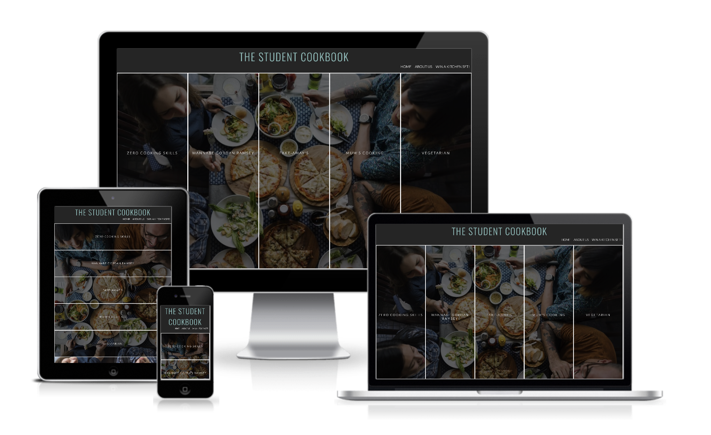
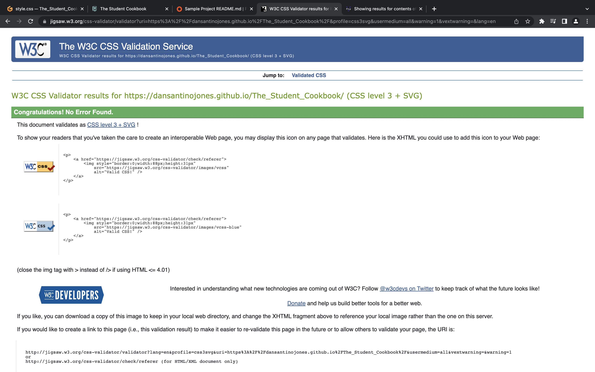
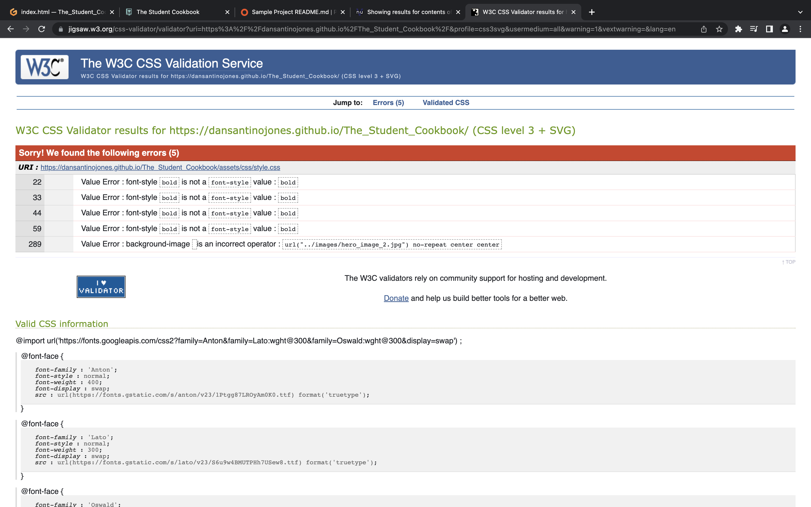

# The Student Cookbook

The Student Cookbook is a UK based website that provides quick, affordable and easy to make recipes for students with a little to no cooking skills. The goal is to be a hub for students to develop their cooking skills during their busy schedules with repeat visits to the website.The landing page will include features such as ‘Category panels’, ‘About Us’ and ‘Win a Kitchen Set!’. There are 5 separate pages with 3 recipes each depending on the users needs. 

The primary goal of the website is to teach students how to cook using basic and easy to follow recipes furthermore repeat visits to the website making The Student Cookbook a hub for learning. The website will allow users to navigate easily through the website and will provide ingredients and directions on how to make affordable meals quickly.  

### Business Goals
- Teach users basic cooking skills 
- Provide easy, quick and affordable meals
- Repeat visits from users

### Customer Goals 
- Easy to navigate website structure 
- Easy to follow recipes 
- Cost, time and how many people the recipe is for
- Visually appealing 

## UX
### Strategy 
Following the core UX principles I firstly decided on the target audience of users and I put myself in their shoes to what features I would want.

#### The Student Cookbook Target Audience:
- Aged 18-30.
- Students.
- People who are learning to cook or people with basic cooking skills.

#### What the users would want from the website:
- Informal language. 
- Easy to follow step by step recipes.
- Mobile friendly therefore must be responsive.
- Visually appealing with concise information.

#### This website is best for users:
- Most cooking websites have formal language and complicated instructions which some students may find difficult to relate to. 
- Most students have only basic ingredients due to their shopping budget and busy schedules. This website teaches students the basic cooking knowledge without overloading them with ingredients and information.

### Scope
To achieve the strategic goals, I included the following features:

- Header containing logo and navigation menu.
- Grid menu displaying different types of recipes.
- About Us section for users to connect on a personal level.
- Form for users to win a kitchen set to help them on their cooking journey.
- Recipe pages with a total of 15 recipes.
- Icons highlighting key information which is concise and visually appealing. 
- Footer with contact details and social icons.

### Structure
Due to the number of recipes a single page website was not suited for this project. However, I decided it was best to have the non-cooking related information on a single page with simple navigation structure. The menu which is consistent across all 6 pages will direct the user to the non-cooking information on the main page. The structure of the main page follows Home > Cooking Category Grid > About Us > Win a Kitchen Set! The first thing the user will see will be the Cooking Category Grid which will direct them to the recipes (the main reason they are visiting the website). Therefore, the non-cooking sections follow. 

The recipe pages follow a similar structure, Cooking Category > Name of the dish > Difficulty, Time, Number of people and average cost > Image of the dish > Ingredients > Directions. I moved the order around a few times and digested the information. I decided this sequence was the easiest to follow without providing too much information at once. 

The footer is consistent on all pages with an arrow pointing up to take the user back to the top of the page. This allows the user to navigate through the website with ease providing a good user experience. 

### Skeleton 
Please note the website has slightly changed since creating the wireframes.

### Surface
The colour scheme of the website was chosen to provide simplicity. The website must be easy to read therefore these colours were best suited. The logo colour matches with the kitchen set demonstrating the brand identity. The teal colour was chosen to represent cool and calmness which students are looking for when browsing the internet for recipes. 

I chose the Oswald font as this was a simple but trendy font which is what the website users are looking for. With a letter spacing and uppercase this provided easy to read information helping achieve the business and customer goals. 

The hover effect was used on the menu and category section to attract the users attention and demonstrate the easy navigation across all pages. 

## Features
### Navigation Bar 
All six pages have a fully functioning navigation bar which include links to the Home, About Us and Win a Kitchen Set! pages which is identical on each page to remain consistent.
This allows users to navigate back to the home page when looking for different category of recipes.

### Grid Category Panels
The landing page provides a relatable photo of students having a meal around a table with overlay panels with navigation to different categories of recipes. 
This section introduces the user to The Student Cookbook and the different options the user has. This is beneficial for users who are ‘Vegetarian’ or have ‘Zero Cooking Skills’ to navigate them to the recipes that are best suited to their needs. 
The language used for the category titles are informal and playful which will relate to the target audience and hopefully demonstrate the fun side of cooking.
The opacity hover effect is used to make the landing page visually appealing to encourage repeat visits. The panels change from vertical to horizontal when the max width reaches for a neater and clearer structure on smaller devices.

### About Us
The About Us section provides a deeper understanding of the purpose and goals of the website allowing the user to connect on a personal level. 
The background colour is used for a consistent brand identity. 

### Win a FREE Kitchen Set!
This section will allow users to be entered into a draw to win a free kitchen set. The user will need to provide their personal details such as name, email and telephone number along with the university they are attending. This is the perfect starter kit for students starting university.
The form includes required name email and telephone to ensure the important information is submitted.
The terms & conditions were included into a drop down menu for users to expand and read therefore saving space on the page. 

### Footer 
The footer section includes links to relevant social media platforms as well as a telephone and email address if users would like to make contact.
The social icon link will open in a new tab to provide a better user experience. 
The footer is identical across all pages providing consistency throughout the website. 
The footer includes an arrow icon which will direct the user back to the top of the page. This provides good user experience when navigating through the website. 

### Recipe Pages
The recipe pages provide three meals giving the user variety of choice. 
The images used on the website are for educational purposes only.
Font Awesome icons are used to provide cons key information which is concise and visually appealing. 
A grid is used to display the ingredients and directions. This allows the user to digest the information in a clear and concise manner. 

### Features left to implement
I beleive the website has plently of opportunities to delevol and improve in the future. The features I would like to implements going forward are: 
- More recipes.
- More cooking categories. 
- Shopping list table with costs.
- Random recipe selector.
- Checkbox bullet points for recipe lists.

### Technologies Used
[HTML](https://developer.mozilla.org/en-US/docs/Web/HTML)
- HTML was used as the building block of the projects content and structure.

[CSS](https://developer.mozilla.org/en-US/docs/Learn/Getting_started_with_the_web/CSS_basics)
- CSS was used to style the web content across all pages.

[Google Fonts](https://fonts.google.com)
- Google Fonts was used to obtain the fonts used in the project. 

[Google Images](https://www.google.co.uk/imghp?hl=en&ogbl)
- Google Images was used to obtain images for the project which were used for educational purposes only.

[Font Awesome](https://fontawesome.com)
- Font Awesome was used to oobtain icons used in the recipe and footer pages.

[Google Developer Tools](https://developer.chrome.com/docs/devtools/)
- Google Developer Tools (devtools) was used to fix errors and test responsivness.

[GitHub](https://github.com)
- GitHub was used to store the code for the project.

[Git](https://git-scm.com)
- Git was used for version control to commit and push to GitHub.

[Gitpod](https://www.gitpod.io)
- Gitpod was used as the development environment.

[Favicon](https://favicon.io)
- Favicon was used to create a favicon for the website.

[Pexels](https://www.pexels.com/)
- Pexels was used to obtain images for the recipes.

[Unsplash](https://unsplash.com/)
- Unsplash was used to obtain images for the recipes.

[Optimizilla](https://imagecompressor.com/)
- Optimizilla was used to compress image to improve the load speed of the website. 

[Color Contrast Acessibility Validator](https://color.a11y.com)
- Used this to test the colour contrast of the backgrounds and fonts.

[W3C Markup Validation Service](https://validator.w3.org)
- W3C Validator was used to validate the HTML code. 

[W3C CSS Validation Service](https://jigsaw.w3.org/css-validator/#validate_by_input)
- W3C Validator was used to validate the CSS code.

[Am I Responsive](https://ui.dev/amiresponsive)
- Am I Responsive was used to obtain final images of my website across different device sizes.

## Testing 
I tested that the page work on Chrome and Safari
I confirmed that the project is responsive having tested screen size using the devtools device toolbar.
I have tested the links and ensures that all follow the right path for navigation.
The form has the required input sections and the submission button opens in a new window. 

### Solved Bugs 
When running a report on lighthouse in devtools. I discovered the kitchen set image was hindering the load speed due to its large file. To overcome this I used Optimazilla to reduce the file size improving the load speed ensuring a better user experience. 

### Validator Testing 
HTML
- No errors were returned when passing through the official W3C validator.

CSS
- 5 errors were found when using the official W3C validator. 
- The error that amounted for 4 errors was font-style: bold; which I resolved by removing it from the CSS rules. 
- The last error was background-image: url(‘../images/hero_image_2.jpg) no-repeat centre centre; This was resolved by removing no-repeat centre centre and including background-repeat: no-repeat; and background-position: centre;

Accessibility
-  I confirm the colours and font choose are easy to read and accessible when running lighthouse in devtools.

Mobile:

Desktop:

### Unfixed Bugs
There are no unfixed bugs as far as I am aware.

### Deployment 

## Credits 
### Content

### Media 

## Acknowledgments 
I would like to thank my course mentor Guido Cecilio for his supporters  and guidance throughout the course and former student Sam Laubscher for his feedback and support.